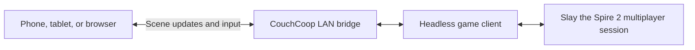

# Slay the Spire 2 Couch Co-op

Turn phones, tablets, and laptops on your local network into browser-based clients for Slay the Spire 2 multiplayer. The host installs the mod; everyone else joins by scanning a QR code, with no client installation required.

> [!WARNING]
> **Beta:** The core game loop is playable, but some screens and actions still have bugs, visual differences, UX rough edges, or performance issues.


## Quick start

1. Install CouchCoop on the host computer:
   - **Steam Workshop:** https://steamcommunity.com/sharedfiles/filedetails/?id=3799476240
   - Alternatively, download `couchcoop-<version>.zip` from [GitHub Releases](https://github.com/tfoxy/sts2-couch-coop/releases/latest) and extract it into the game's `mods` folder. One download covers both the normal game and its `public-beta` branch on Steam.
2. Start or load a multiplayer run.
3. Select **Couch Co-op QR Code** in the hosted lobby.
4. On each additional device, scan the QR code or enter the displayed URL.
5. Enter a player name and join.

You can also use CouchCoop by yourself and play from your phone. Slay the Spire 2 must still be running on the host computer.

<details>
<summary>Verify a GitHub Release download</summary>

Official releases include SHA-256 checksums and a GitHub build attestation. To verify a downloaded ZIP with the [GitHub CLI](https://cli.github.com/), run:

```sh
gh attestation verify <zip> -R tfoxy/sts2-couch-coop
```

</details>

## Features

- **Browser-based clients:** join from a recent version of Chrome, Firefox, or Safari without installing the game or mod on each device.
- **Touch-friendly controls:** dragged cards appear above your finger, invalid drops return cards and potions to their original position, and a second tap confirms irreversible choices after showing their details. Long-pressing a card outside your hand opens its details.
- **Readable phone layout:** important text and controls are enlarged, and the game layout can spread horizontally across a landscape screen.
- **Easier hand reading:** on phones, cards can remain raised so their descriptions are visible at a glance. Creature health, powers, and intents remain visible above the hand.
- **Lower bandwidth than video streaming:** the client receives scene updates and reusable assets instead of a continuous video stream.

## Requirements

### Host computer

These are tested configurations for a four-player session, not guaranteed hardware minimums.

| Configuration | CPU | RAM | Result |
| --- | --- | --- | --- |
| Lowest tested | Intel Core i5-6200U | 8 GB | Playable, with occasional lag for all players |
| Recommended | Intel Core i7-11370H | 16 GB | Played without noticeable issues |

The GPU requirements are similar to the base game. Windows and Linux are tested; macOS is not, and has some extra setup — see [macOS](#macos) below.

<details>
<summary>Host resource usage</summary>

Each browser player requires a separate headless game client on the host. In testing, each additional player used roughly 20% more CPU and 50% more RAM than the base game, although short CPU spikes can be higher. A four-player session therefore used about 60% more CPU and 150% more RAM.

</details>

### macOS

Slay the Spire 2 has a native macOS build, and nothing in CouchCoop refuses to run on it — but nobody has yet played a full session on a Mac, so treat what follows as untested rather than supported. If you try it, please [report what you find](https://github.com/tfoxy/sts2-couch-coop/issues/new?template=bug_report.yml).

**Install from the Steam Workshop.** On macOS the game's `mods` folder is inside the application bundle, at `SlayTheSpire2.app/Contents/MacOS/mods`, which Finder only opens after right-clicking the app and choosing **Show Package Contents** — and writing anything into a signed bundle breaks its signature. Steam installs Workshop content outside the bundle instead, so a subscription avoids the folder and the signature both. The manual ZIP still works if you prefer it; just know what it touches.

**Two permission prompts stand between the host and your phones.** macOS asks about local network access and, if the firewall is on, about incoming connections. If either is answered "no", the host still starts and the QR code still scans — the phone simply waits and then times out, with nothing on the host to say why.

- **Local Network** lives in System Settings → Privacy & Security → Local Network. Because Steam launches the game, the prompt can be attributed to Steam rather than to Slay the Spire 2, can have been answered long before you installed CouchCoop, or can be drawn behind the fullscreen game. Check that both entries are switched on.
- **The firewall** lives in System Settings → Network → Firewall. When it is on, macOS asks once whether to accept incoming connections for the game, and remembers a "Deny". Firewall → Options is where to change that answer, and "Block all incoming connections" overrides everything else.

**Back up your saves first.** Each browser player gets an isolated local Godot profile. On macOS CouchCoop gives
each seat a fake `$HOME` and links ordinary home files back to the host while keeping
`Library/Application Support/SlayTheSpire2` private. CI verifies that stock Godot honors this layout, but nobody
has yet played a full game session on a Mac. Steam, FMOD, or code using `getpwuid` may still choose paths outside
`$HOME`; report any Mac session result, especially a save or mod-loading problem.

### Steam Deck

Steam Deck can host CouchCoop, in Game Mode as well as Desktop Mode. The lobby's **Couch Co-op QR Code** button cannot be reached by the controller's normal menu navigation, so it has its own binding: press the west face button (**X** on the Deck) while the lobby is on screen. The button shows that glyph whenever a controller is in use.

The Deck's four cores share a 15 W power budget with the GPU, so plan for one or two browser players rather than four — each one adds a full headless game process (see host resource usage above). A player's game also takes noticeably longer to start there than on a desktop, which is normal; the lobby says so while it waits. Finally, a nearly full storage device leaves less than the managed cache's 2 GiB free-space reserve (see the [security model](docs/security.md)), so newly generated assets fall back to an in-memory or raster path instead of persisting to disk.

### Client devices

Use an up-to-date version of Chrome, Firefox, or Safari. Devices with at least 4 GB of RAM have been tested, but performance also depends on their GPU, operating system, temperature, and visual settings.

The client can consume significant power. Start with enough battery for the session when possible. Charging while playing may increase heat and reduce performance on some phones.

<details>
<summary>Tested phones and tablets</summary>

- iPhone 17
- Samsung Galaxy S25 Ultra
- Google Pixel 6a
- Samsung Galaxy A55
- Lenovo Tab P12
- Samsung Galaxy A52
- Motorola Moto G86
- Xiaomi Redmi Note 10S
- Motorola Moto G31
- Xiaomi Mi A2

The Moto G31 and Xiaomi Mi A2 were the least powerful devices tested and still provided a usable experience with the default performance settings.

</details>

### Network

All browser clients must be able to reach the host on the same local network. Guest Wi-Fi and client isolation may block connections even on the same router. For best results, connect the host by Ethernet and use 5 GHz Wi-Fi for client devices; 2.4 GHz may add latency or stability problems.

Only run CouchCoop on a local network whose participants you trust. Anyone who can reach the join address can open the client and send ordinary game controls. See the [security model](docs/security.md) for details.

## Compatibility

CouchCoop is designed to work alongside gameplay mods, but combinations have not been extensively tested. Please [report any incompatibility](https://github.com/tfoxy/sts2-couch-coop/issues/new?template=bug_report.yml) and list every mod used in the session.

## How it works

CouchCoop is closer to a remote game client than a video stream. When a browser player joins, the host launches a headless copy of Slay the Spire 2 for that player and connects it to the multiplayer session. The browser receives scene state and assets from that client, renders the relevant Godot UI, and sends touch, pointer, and keyboard input back.



The browser renderer is built on [`tfoxy/godot-scene-web`](https://github.com/tfoxy/godot-scene-web). Textures are transferred once and cached, while animations and selected interactions run partly in the browser to reduce bandwidth and perceived latency. Static backgrounds and effects reduce rendering work on lower-end phones; visual quality can be adjusted further in the client settings.

See [Architecture](docs/architecture.md) for a technical overview of the components, data flow, performance strategy, and validation approach.

### Trade-offs and limitations

- Network or processing delays can make an element appear late, skip part of a transition, or feel less responsive than the native game.
- The host, network, headless game client, and browser introduce more possible failure points than a native client.
- Every browser player adds another game process on the host, increasing CPU and memory requirements.
- Browser rendering aims for close visual and interaction parity, but it will not always match the native game exactly.

## Development approach and AI usage

This project began as an experiment in AI-assisted software development. Most implementation code in this and related repositories was drafted with AI tools. The process involved defining the product, directing and reviewing changes, investigating failures, measuring performance, and building validation tools.

Early implementations were often incorrect or too slow, so the workflow evolved around reproducible scenarios, rendering-parity checks, interaction tests, performance measurements, and multiple agents working in parallel. The important take was that generation speed matters much less than architecture, review, profiling, and validation.

This approach worked well here because the original game provides a concrete behavioral and visual baseline. That does not mean the same approach will work equally well for every game or mod. [`tfoxy/spirectl`](https://github.com/tfoxy/spirectl) contains much of the experimental tooling used by the agents working on this project.

I wrote the original README and used AI to improve its English, structure, and clarity.

## Feedback and questions

- [Report a bug](https://github.com/tfoxy/sts2-couch-coop/issues/new?template=bug_report.yml)
- [Request a feature](https://github.com/tfoxy/sts2-couch-coop/issues/new?template=feature_request.yml)
- [Ask a question or start a discussion](https://github.com/tfoxy/sts2-couch-coop/discussions)

Code contributions and pull requests are not currently accepted. Reviewing untrusted changes safely in an agent-assisted workflow requires more maintainer time than I can currently provide.

## License and disclaimers

CouchCoop is licensed under Apache 2.0. See [LICENSE](LICENSE), [NOTICE](NOTICE), and [third-party notices](THIRD_PARTY_NOTICES.md).

This project is not affiliated with or endorsed by Mega Crit. It requires your own legitimately obtained copy of Slay the Spire 2. No game assets are bundled or redistributed; game content is read at runtime from your local installation and served only during your LAN session.

The mod is free and open source. Under [Mega Crit's Content Policy](https://www.megacrit.com/content-policy/), mods may accept donations but may not otherwise be monetized.
