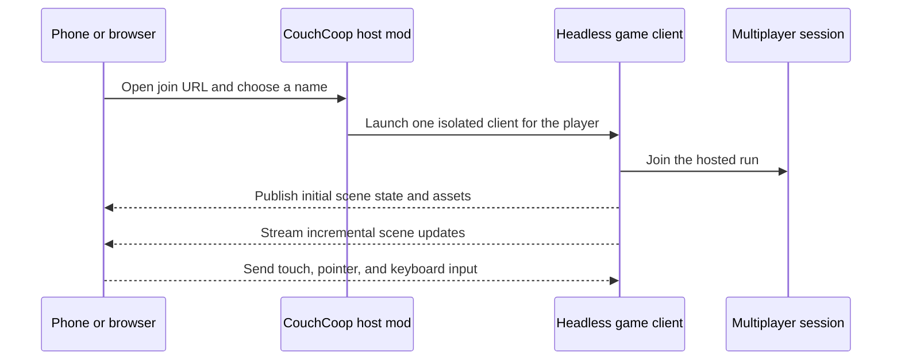

# Architecture

CouchCoop turns ordinary web browsers into clients for a Slay the Spire 2 multiplayer session. It does not stream a video of the host's screen. Instead, each browser player is backed by a headless game client that publishes the scene state and accepts the player's input.

This document describes the public architecture at a high level. It intentionally omits private game internals and focuses on the components and engineering trade-offs owned by this project.

## Runtime components

| Component | Technology | Responsibility |
| --- | --- | --- |
| Host mod | C# / .NET | Presents the QR-code join flow, hosts the local browser service, and manages browser seats |
| Headless game client | C# / Godot runtime | Joins the multiplayer session for one browser player and provides that player's game view |
| Browser client | Vue / TypeScript | Reconstructs the scene, adapts it for small touch screens, and captures player input |
| Mirror protocol | C# and TypeScript consumers | Carries scene snapshots, incremental updates, assets, animations, and input |
| Presentation libraries | [`spirectl`](https://github.com/tfoxy/spirectl) and [`godot-scene-web`](https://github.com/tfoxy/godot-scene-web) | Provide reusable game inspection and Godot-to-web presentation support |

## Join and data flow

The host creates a separate headless client for each browser player. This preserves the game's normal per-player view and multiplayer behavior without requiring the phone to run the native game.

The browser receives a larger initial snapshot and the assets needed by the current view. After that, the protocol favors incremental state changes, animation descriptions, and cached resources.

## Why scene synchronization instead of video

Video streaming would make the phone a thin input device, but the host would also need to render and encode a separate video stream for every player. CouchCoop moves much of the presentation work to the browser instead.

This approach provides several useful properties:

- UI elements remain available as interactive browser-rendered content.
- Touch behavior can be adapted without changing the underlying multiplayer rules.
- Text and controls can be enlarged or rearranged for small screens.
- Assets can be transferred once and reused from memory or local caches.
- Many transitions can play locally without receiving new geometry for every frame.

The trade-off is complexity. The browser must reproduce enough Godot layout, drawing, animation, and hit-testing behavior to remain visually and interactively close to the native client.

## Rendering and performance strategy

The mirror sends scene structure and incremental changes instead of rebuilding the entire view continuously. The browser caches textures and other stable resources, applies supported transitions locally, and handles selected interactions such as scrolling or card movement without waiting for every visual update to make a round trip through the host.

More expensive visual effects can be represented by static frames or rendered at lower quality. Backgrounds can also be flattened into a single image. These defaults reduce network traffic and client rendering cost, especially on older phones.

Each browser seat still requires a headless game process. The host therefore trades the cost of multiple rendered video streams for the CPU and memory cost of multiple game clients. Network delays and missed or late scene updates can also produce visual differences that would not occur in a native client.

## Touch adaptation

The browser translates touch gestures into the same classes of input expected by the game while adding safeguards for a small screen:

- Cards being dragged are offset above the finger so their targets remain visible.
- Invalid drops return the card or potion instead of leaving it in an ambiguous state.
- Irreversible choices use a first tap for inspection and a second tap for confirmation.
- Long presses expose card details that would normally be reached through mouse input.
- Layout and input coordinates are adjusted together when controls are enlarged or spread across a wider display.

## Validation

The project uses several layers of validation because a browser mirror can be functionally correct while still looking or feeling wrong:

- C# protocol and mod tests cover message contracts, session behavior, resource limits, and server boundaries.
- Frontend unit tests cover rendering, input classification, layout transforms, and settings.
- Browser end-to-end tests exercise the join and interaction flows.
- Recorded scenarios replay deterministic scene updates without launching the game.
- Live touch harnesses verify gestures against an isolated game instance.
- Rendering and performance benches compare output, frame cost, memory use, and behavior on real devices.

The repository's detailed QA documents are written for development agents and maintainers. They record exact test commands, known baselines, and the evidence required before changing high-risk input or rendering behavior.

## Repository map

| Path | Contents |
| --- | --- |
| `src/` | Host mod, server, session management, and shared mirror protocol |
| `frontend/` | Vue/TypeScript browser client and frontend tests |
| `tests/` | C# protocol, mod, and hosted-server test runners |
| `scripts/` | Packaging, validation, replay, profiling, and QA tools |
| `docs/` | Configuration, security, architecture, and maintainer documentation |

Players should install a published release rather than build from source. Local development requires a legitimately obtained game installation and the setup described in [Configuration](configuration.md).
